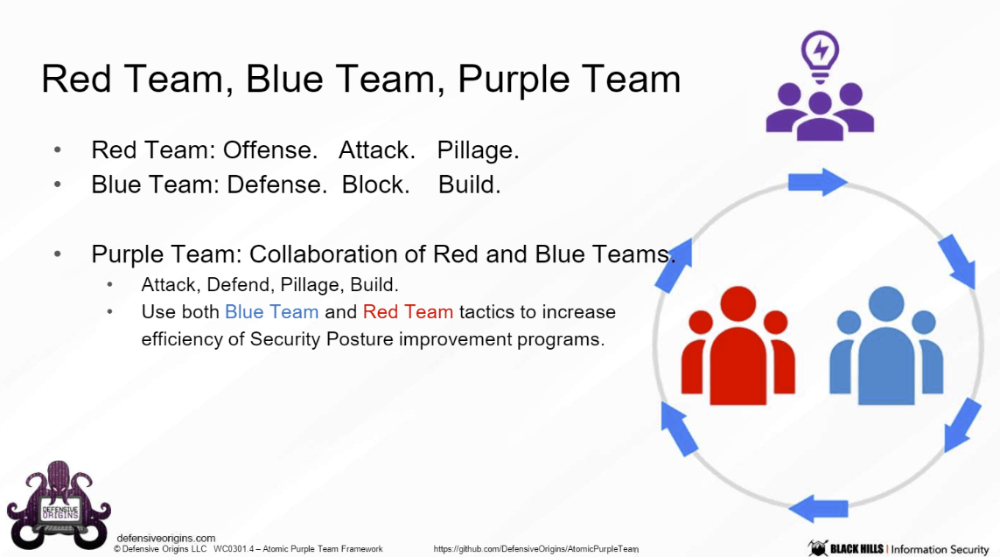
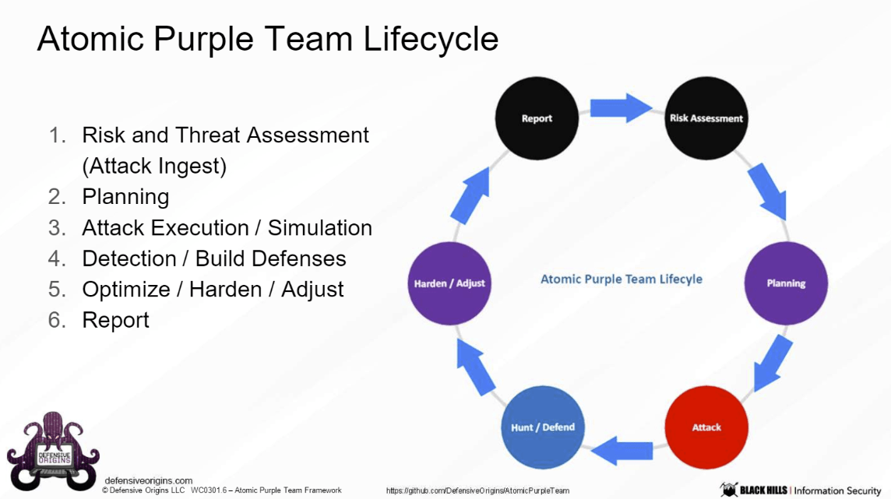
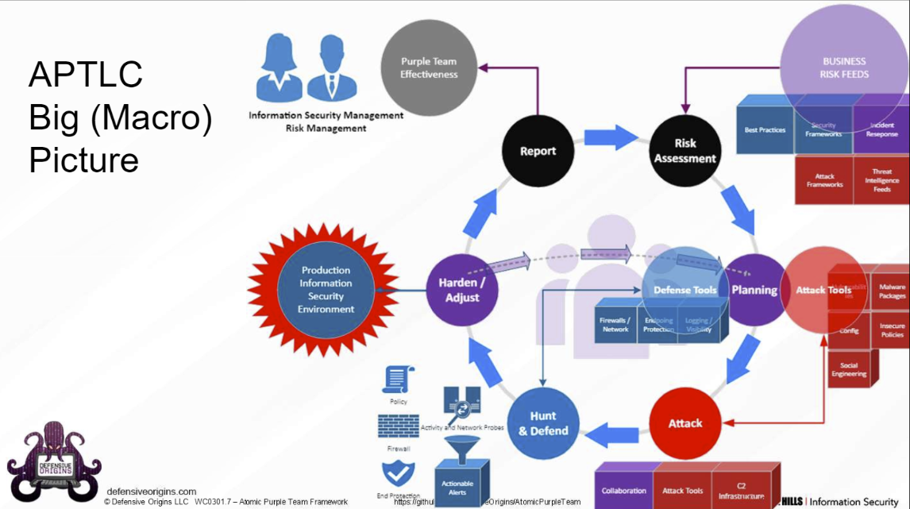
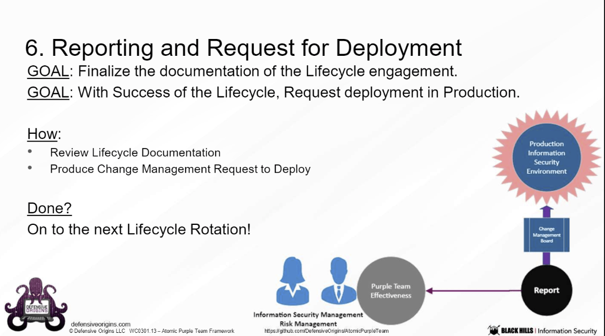

# AtomicPurpleTeam
Atomic Purple Team Framework and Lifecycle

# Atomic Purple Team Framework and LifeCycle

**Documentation Incomplete and in Progress**

The Atomic Purple Team Framework and Lifecycle is a business/organizational concept designed to assist organizations in building, deploying, maintaining, and justying Attack-Detect-Defend Information Security Exercises.

Organizations struggling to efficiently leverage the skillsets of all information security staff will benefit from considering the Atomic Purple Team Lifecycle Framework's business driven workflow. The workflow takes its roots from tested continuous improvement frameworks like ISO9001, ISO27001, Six Sigma and the like.  The methodical balance of risk analysis, attack, hunt and defend methodologies, and business considerations can effectively and continually improve an organizations' security posture.

<!-- Start Document Outline -->

* [Call to Action - Help the Atomic Purple Team Framework](#call-to-action---help-the-atomic-purple-team-framework)
* [Background](#background)
	* [Namesake](#namesake)
	* [Announcement and Open Source](#announcement-and-open-source)
		* [Soft Release - Black Hills Information Security Hosted Webcast](#soft-release---black-hills-information-security-hosted-webcast)
* [Atomic Purple Team Framework](#atomic-purple-team-framework)
* [Atomic Purple Team Life Cycle](#atomic-purple-team-life-cycle)
	* [Life-cycle  &amp; Phases](#life-cycle---phases)
		* [1. Risk Assessment / Ingest](#1-risk-assessment--ingest)
		* [2.  Planning](#2--planning)
		* [3. Attack](#3-attack)
		* [4. Hunt / Defend](#4-hunt--defend)
		* [5. Harden / Adjust](#5-harden--adjust)
		* [6. Report](#6-report)
	* [Initiating and Operating a Life-cycle Exercise](#initiating-and-operating-a-life-cycle-exercise)
		* [Always start in Lab](#always-start-in-lab)
		* [Always complete in Production](#always-complete-in-production)
* [Atomic Purple Team Playbook](#atomic-purple-team-playbook)
	* [Brevity is key.](#brevity-is-key)
	* [Playbook Sections](#playbook-sections)
		* [Project/Exercise Administration](#projectexercise-administration)
		* [Risk Assessment/Ingest/Planning](#risk-assessmentingestplanning)
		* [Attack](#attack)
		* [Detect / Defend](#detect--defend)
		* [Adjust / Harden](#adjust--harden)
		* [Change Management](#change-management)
		* [Report and Lessons Learned](#report-and-lessons-learned)
* [License](#license)

<!-- End Document Outline -->

---

## Call to Action - Help the Atomic Purple Team Framework
The Atomic Purple Team Framework yields itself to community involvement in the steering and feedback from deployments in business organizations.  Defensive Origins knows that not all businesses are alike.  We ultimately hope that the framework will be widely suitable for many organizations and encourage feedback from those who have deployed the framework in their environment.  Open Issues on areas of the lifecycle that you have feedback.  Lets work together to make the Atomic Purple Team Framework and Lifecycle a functional organizational tool that makes the world a better by place encouraging secure operations.  Typo correction pull-requests are always welcome!

## Background
Kent and Jordan have been working in Information Security for quite awhile now.  Despite working with Red-Teams and learning the adversarial toolsets, we are still blue-blood at heart. It gave us an opportunity to reflect at while the past years' Purple Teaming efforts never seemed as effective as they could (should) have been.  

Leveraging their background in business leadership, Kent and Jordan sought to create a business framework that would avoid the pitfalls of cooperate career identity ambiguity and instead focus on what skills Information Security Professionals have spent years mastering.

The Atomic Purple Team Framework and Life-cycle are composed of three main components:
* Atomic Purple Team Framework: The business organizational framework defining job functions, responsibilities, and activities.
* Atomic Purple Team Life-cycle: The Attack-Detect-Defend exercises performed by members of the Atomic Purple team within an organization, as defined by the Atomic Purple Team Framework.
* Atomic Purple Team Playbook: The historical record of the Atomic Purple Team Life cycle execrises performed by the Atomic Purple team.  The playbook offers accountability, evidence of work, and warrant of fiscal budget.

### Namesake
in 2019 Defensive Originals was founded as a research and knowledge opportunity institution.  The first class was titled "Atomic Purple Teaming".   The class was great, however the title of the course offered some in the community confusion, expecting an automation or solution based framework more tightly aligned with Red Canary's[ Atomic Red Team][1] project.  Despite having self published their first book, Atomic Purple Team, Defensive Origins pivoted and re-titled their classroom instructional series, Applied Purple Teaming.  

The Applied Purple Teaming course continues to grow, updating and adding additional attack-detect-defend exercises offering students practical experience.  Many students acknowledged the courses' foundational chapter focusing on a business framework and life-cycle supportive of attack-detect-defend activities as being potentially pivotal in their own organization.  At students requests, Defensive Origins chose to release theframeworkk and life-cycle as an open source initiative, titling the project after its first instructional course the **Atomic Purple Team Framework**.

While the framework does not necessarily provide automated adversarial attacks in the same capacity of the Atomic Red Team project, it is designed to provide businesses a framework for deploying, maintaining, and justifying continued Attack-Detect-Defend security excises.

## Announcement and Open Source
Defensive Origins announced the release of the Atomic Purple Team as a GNU3 open source project hoping to democratize the framework in such a way to allow other organizations to increase their information security posture by utilizing their existing skilled workforce without having to pay hefty licensing, consulting, or subscriptions services.  The team rather enjoys teaching organizations and professionals expert technique and business know how.  For additional information on Defensive Origins teaching offerings, please see https://training.defensiveorigins.com

### Soft Release - Black Hills Information Security Hosted Webcast
 BHIS hosted Defensive Origins Open Source release of the Atomic Purple Team Framework on - July 16th, 2020.  [Recording TBA]

# Atomic Purple Team Framework
The atomic purple team is a leveraging of both Red Team and Blue Team skill-sets.

|  |

# Atomic Purple Team Life Cycle 

## Life-cycle  & Phases

|  |
|  |
|----------|

### 1. Risk Assessment / Ingest

### 2.  Planning
* Goals
  * Identify the Attack toolset
  * Identify the Detect/Defend toolset
* How
  * Information provided in Risk Assessment/Ingest
  * Research
  * New Tools

### 3. Attack
* Goals
  * Execute the Attack
* Sample Reflection on Attack
  * What attacks were successful
  * What data could be found
  * Was a pivot possible
  * Could a C2 be achieved
  * Did the attack achieve its goal?

### 4. Hunt / Defend

### 5. Harden / Adjust

### 6. Report

## Initiating and Operating a Life-cycle Exercise

### Always start in Lab

### Always complete in Production

|  | 
|----------|

# Atomic Purple Team Playbook
[Documentation not yet written]
See the Playbook folder for template.

## Brevity is key.
* Consumable by All
* Remember, Playbook = Budget.
 
## Playbook Sections

### Project/Exercise Administration

### Risk Assessment/Ingest/Planning

### Attack

### Detect / Defend

### Adjust / Harden 

### Change Management

### Report and Lessons Learned

# Advisory and Initial Code Contribution
Community involvement is what makes this industry great!  Initial code contribution and current advisory council is identified below.

* [Black Hills Information Security](https://www.blackhillsinfosec.com) | @[BHInfoSecurity](https://twitter.com/BHinfoSecurity) | [Discord](https://discord.gg/J4UJPgG)
* [Defensive Origins](https://www.defensiveorigins.com)   |  [@DefensiveOGs](https://twitter.com/DefensiveOGs) | [Git](https://github.com/DefensiveOrigins) 
* Kent Ickler  |  @[Krelkci](https://twitter.com/Krelkci) | [Git](https://github.com/Relkci)
* Jordan Drysdale |  [@Rev10D](https://twitter.com/Rev10D) | [Git](https://github.com/rev10d)

# License
Defensive Origins has release the Atomic Purple Team with a GNU GPL3 license, encouraging community involvement and democratization without the necessity of licensing, subscription, or consulting fees.  
[GNU GPL3](https://github.com/DefensiveOrigins/PlumHound/blob/master/LICENSE) 